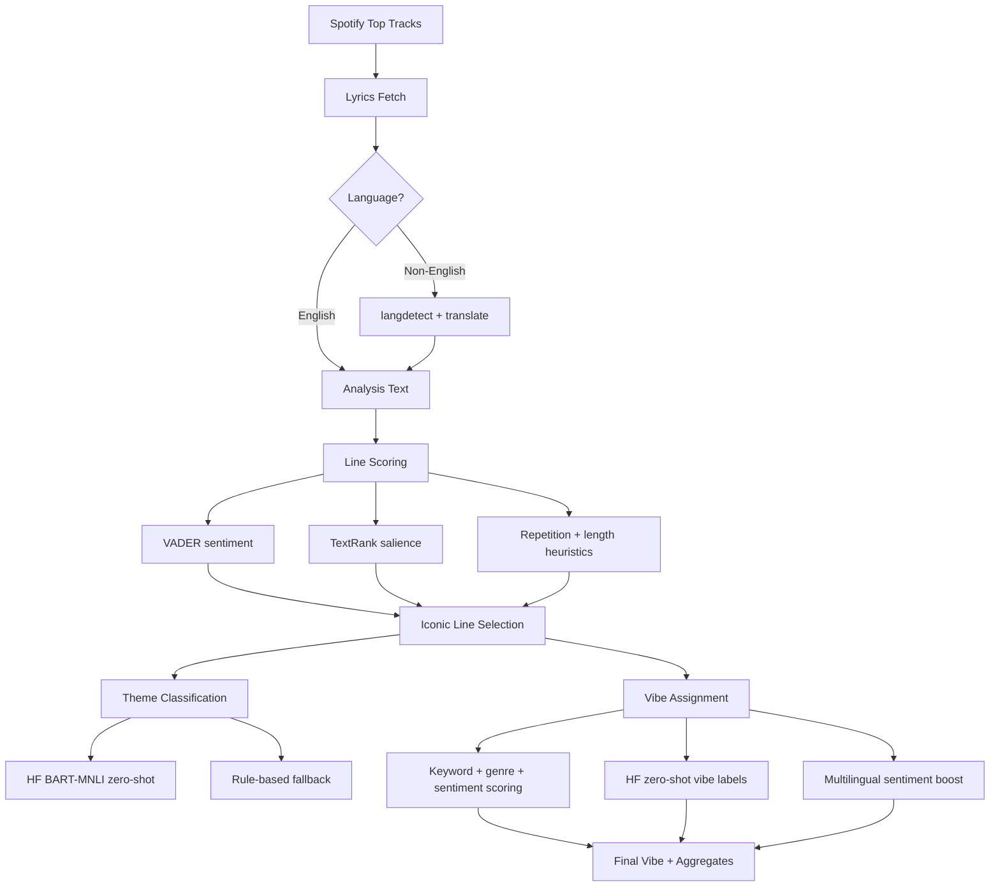

**Turn your Spotify listening history into an NLP-powered emotional breakdown** — lyric extraction, sentiment analysis, zero-shot vibe classification, and an interactive scroll journey through your top tracks.

Built as a full-stack ML application to practice real-world NLP pipelines, API orchestration, and production-minded engineering (caching, concurrency, fallbacks).

---

## Skills at a Glance

`Python` · `NLP` · `Sentiment Analysis` · `Zero-Shot Classification` · `Multilingual Text` · `FastAPI` · `React` · `REST APIs` · `Data Pipelines` · `Concurrent Processing` · `Feature Engineering` · `Model Ensembling` · `TextRank` · `VADER`

---

## What It Does

1. Authenticates with Spotify OAuth and pulls up to **50 top tracks** (short / medium / long term).
2. Fetches lyrics via **LRCLIB** (primary) and **Genius** (fallback), with disk caching.
3. Runs a **hybrid NLP pipeline** on each song: language detection, translation, line scoring, theme classification, and aesthetic vibe assignment.
4. Returns a personalized breakdown: iconic lyric lines, emotional themes, word frequencies, listening eras, and scroll-synced audio previews.
5. Presents results in a **scrollytelling UI** — chapter-based vibe journey, word cloud, share card, and envelope reveal.

---

## Demo


---

## ML / NLP Pipeline



### Models & methods used

| Task | Approach |
|------|----------|
| **Iconic line selection** | Ensemble scoring: VADER polarity, TextRank sentence salience, chorus repetition, length heuristics |
| **Theme classification** | Hugging Face `facebook/bart-large-mnli` (zero-shot) + VADER fallback |
| **Vibe / aesthetic labeling** | 16-class hybrid classifier: keyword profiles, genre metadata, sentiment ranges, zero-shot HF inference, multilingual sentiment boost |
| **Multilingual lyrics** | `langdetect` + `deep-translator`; display original language, analyze on English text |
| **Multilingual sentiment** | Hugging Face `tabularisai/multilingual-sentiment-analysis` via Inference API |
| **Word cloud** | NLTK tokenization + stopword filtering + frequency ranking |

### Design decisions (ML-relevant)

- **Hybrid over pure ML** — Rule-based vibe profiles + HF zero-shot gives interpretable labels and handles edge cases (e.g. disambiguating *yearning* vs *hopeless romantic* using sentiment + keyword density).
- **Bilingual line picking** — Scores lines on translated text but surfaces the original-language lyric to the user.
- **Confidence gating** — When top vibe scores are too close, falls back to theme-derived defaults instead of over-confident predictions.
- **Graceful degradation** — HF API failures fall back to VADER + heuristics; missing lyrics skip the track without blocking the batch.

---

## Skills Gained

### NLP & ML
- Built an end-to-end **text analysis pipeline** from raw lyrics → structured labels
- Applied **zero-shot classification** for open-vocabulary theme and vibe inference without custom training data
- Combined **lexicon-based** (VADER) and **graph-based** (TextRank) methods for line importance
- Handled **multilingual input**: detection, translation, and cross-lingual sentiment scoring
- Practiced **feature engineering** — metadata (title, genre) fused with text features for classification
- Implemented **ensemble-style scoring** with tunable weights and fallback logic

### Data & Systems
- **Parallel song processing** with `ThreadPoolExecutor` (50 tracks in ~5–10s after lyrics are cached)
- **Multi-layer caching** — lyrics, session results, preview URLs on disk
- **Progressive API design** — polling endpoint streams partial results while analysis runs
- **API orchestration** across Spotify, LRCLIB, Genius, Hugging Face, and Deezer (preview fallback)

### Engineering
- Full-stack delivery: **FastAPI** backend + **React** frontend with OAuth flow
- Production patterns: session persistence, background tasks, thread-safe state, CORS
- UX for long-running ML jobs: loading states, live progress, scroll-triggered audio

---

## Architecture

```
spotify-personalizer/
├── main.py                 # FastAPI app, OAuth, session management, parallel analysis
├── services/
│   ├── analysis.py         # NLP pipeline, vibe scoring, HF inference
│   ├── lyrics.py           # LRCLIB + Genius fetch, lyrics cache
│   ├── language.py         # langdetect + translation
│   └── previews.py         # Preview URL resolution (Spotify embed / Deezer)
├── spotify-frontend/       # React UI — scroll journey, word cloud, share card
└── requirements.txt
```

**Backend:** FastAPI · Spotipy · NLTK · Sumy · langdetect · deep-translator · requests  
**Frontend:** React · React Router · Framer Motion · SCSS · html2canvas  
**ML APIs:** Hugging Face Inference (`bart-large-mnli`, `multilingual-sentiment-analysis`)

---

## Setup

### Prerequisites
- Python 3.9+
- Node.js 18+
- [Spotify Developer](https://developer.spotify.com/dashboard) app (OAuth)
- [Genius API](https://genius.com/api-clients) token (lyrics fallback)
- [Hugging Face](https://huggingface.co/settings/tokens) API token (zero-shot + sentiment)

### 1. Clone & install

```bash
git clone https://github.com/hudasir4j/spotify-personalizer
cd spotify-personalizer

python -m venv venv && source venv/bin/activate
pip install -r requirements.txt

cd spotify-frontend && npm install
```

### 2. Environment variables

**Root `.env.local`** (backend):

```env
PYTHON_ENV=local
SPOTIPY_CLIENT_ID=your_spotify_client_id
SPOTIPY_CLIENT_SECRET=your_spotify_client_secret
REDIRECT_URI=http://127.0.0.1:8000/callback
FRONTEND_URL=http://127.0.0.1:3000
GENIUS_TOKEN=your_genius_token
HF_API_TOKEN=your_huggingface_token
```

**`spotify-frontend/.env.local`**:

```env
REACT_APP_BACKEND_URL=http://127.0.0.1:8000
```

> Use `127.0.0.1` (not `localhost`) for Spotify OAuth redirect consistency.

### 3. Run

```bash
# Terminal 1 — backend
PYTHON_ENV=local uvicorn main:app --reload --port 8000

# Terminal 2 — frontend
cd spotify-frontend && npm start
```

Open `http://127.0.0.1:3000`, log in with Spotify, and wait for analysis to complete.

---

## Author

**Huda** — [GitHub](https://github.com/hudasir4j)
